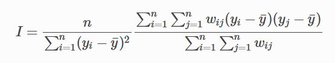

# Introduction
Business is the cornerstone of prosperity in society. Companies create the resources that permit social development and welfare. In the background of number of companies is growing bigger and changing rapidly, we can not know structure of their distribution among industries if we do not conduct effective analysis. 
<br><br>In order to get to understand business pattern in the society and support questions such as which states are with the largest scale of business, what is payroll status of different industries like, what are the competitive industries of New York state, this study is designed to help.
<br><br>It is intriguing and meaningful to explore deep into massive data to get holistic perception of the society’s business status and comprehensive understanding of some particular industries. In this study, figures and interactive graphics will be produced to get knowledge about industries status among different states using indexes like employment, annual payroll and number of firms. The relationship between employment and annual payroll will be discussed. Industries development status in New York state will be focused on. And actual data will be used to identify spatial autocorrelation of information industry. 

-----------------------------------------------------------------------

# Materials and methods {.tabset .tabset-fade}
##Packages
Here are all the packages needed for the project:
```{r, message=F, warning=F,tidy=TRUE}
library(readxl)
library(ggplot2)
library(highcharter)
library(dplyr)
library(viridisLite)
library(forecast)
library(treemap)
library(flexdashboard)
library(leaflet)
library(sp)
library(geojson)
library(geojsonio)
library(rgdal)
library(foreach)
library(rbokeh)
library(plotly)
library(raster)
library(spdep)
library(knitr)
library(sf)
library(widgetframe)
knitr::opts_chunk$set(cache=TRUE)  # cache the results for quick compiling
```
<br>

##Data
Original data including American Annual Payroll and Employment by states (2015), American Annual Payroll and Employment among industries by states (2015), the US states polygon data (geojson). Modifications are made to make these data more suitable for the project. <br><br>
**1. Total number of firms among different states:** 
```{r, warnings=F}
if (!file.exists("./data/total_2015.xlsx"))
{
download.file("https://www2.census.gov/programs-surveys/susb/tables/2015/us_state_totals_2015.xlsx",destfile = "./data/total_2015.xlsx",mode="wb")
}
dataset <- read_excel("./data/total_2015.xlsx",1,skip=16)
colnames(dataset) <- c("FIPS","Geo_Des","Emp_Size","NFirms","NEst","NEmp","Flag","Ann_Pay","Ann_Flag")
subset <- dataset[dataset$Emp_Size=="01:  Total",]
knitr::kable(head(subset), caption = "") 
```

**2. Geojson Data with interested industries:** 
```{r, warnings=F}
df <- read.csv(file="./data/ann_industry.csv",header=TRUE,skip=2)
colnames(df) <- c("GEOID","ID","GEO_NAME","NAICS","INDUSTRY","YEAR","ESTAB","EMP","PAYQ1","PAYANN")

url <- "http://leafletjs.com/examples/choropleth/us-states.js"
doc <- readLines(url)
doc2 <- gsub("var statesData = ", "", doc)
fn<-tempfile()
write(doc2,fn)
write(doc2, file = "data/us-states.geojson")
poly <- readOGR(dsn=fn)
states <- geojsonio::geojson_read("data/us-states.geojson", what = "sp")
for(i in 1:nrow(poly))
{
poly[i,'Agriculture'] <- as.numeric(df[which(df$GEO_NAME==as.character(poly[i,]$name) & df$INDUSTRY=='Agriculture, forestry, fishing and hunting'),][1,10])
poly[i,'Utilities'] <- as.numeric(df[which(df$GEO_NAME==as.character(poly[i,]$name) & df$INDUSTRY=='Utilities'),][1,10])
poly[i,'Manufacturing'] <- as.numeric(df[which(df$GEO_NAME==as.character(poly[i,]$name) & df$INDUSTRY=='Manufacturing'),][1,10])
poly[i,'Information'] <- as.numeric(df[which(df$GEO_NAME==as.character(poly[i,]$name) & df$INDUSTRY=='Information'),][1,10])
poly[i,'HealthCare'] <- as.numeric(df[which(df$GEO_NAME==as.character(poly[i,]$name) & df$INDUSTRY=='Health care and social assistance'),][1,10])
poly[i,'Arts'] <- as.numeric(df[which(df$GEO_NAME==as.character(poly[i,]$name) & df$INDUSTRY=='Arts, entertainment, and recreation'),][1,10])
}
```

**3. Status of industries among different states:** 
```{r, warnings=F}
df2 <- read.csv(file="./data/ann_industryc.csv",header=TRUE)
colnames(df2) <- c("GEOID","ID","GEO_NAME","NAICS","INDUSTRY","YEAR","ESTAB","EMP","PAYQ1","PAYANN") 
knitr::kable(head(df2), caption = "") 
```
<br>

##Methods
Different kinds of interactive visualization, spatial autocorrelation are used as main methods in the project.

<br>

# Results

### Numbers of Firms by State
Scale of business among states can be somehow recognized based on the number of firms. Interactive map showed below provides preliminary knowledge of business scale. 

```{r, warning=F}
thm <- 
  hc_theme(
    colors = c("#1a6ecc", "#434348", "#90ed7d"),
    chart = list(
      backgroundColor = "transparent",
      style = list(fontFamily = "Source Sans Pro")
    ),
    xAxis = list(
      gridLineWidth = 1
    )
  )
n <- 4
colstops <- data.frame(
  q = 0:n/n,
  c = substring(viridis(n + 1), 0, 7)) %>%
  list_parse2()

highchart() %>%
  hc_add_series_map(usgeojson, subset, name = "Number of Firms",
                    value = "NFirms", joinBy = c("woename", "Geo_Des"),
                    dataLabels = list(enabled = TRUE,
                                      format = '{point.properties.postalcode}')) %>%
  hc_colorAxis(stops = colstops) %>%
  hc_legend(valueDecimals = 0, valueSuffix = "%") %>%
  hc_mapNavigation(enabled = TRUE) %>%
  hc_add_theme(thm)
```

Payroll and Employment {.tabset data-width=400}
-----------------------------------------------------------------------

### Annual Payroll by State
Two interactive figures showed below are to provides some more detailed knowledge of business scale among states based indexes of annual payroll and employment. The first fugure uses area of polygon to represent the number of annual payroll and the unit is 1000 dollars. The second figure lists states with top 10 employment. It is easy to find that ranks of annual payroll and employment are similar.

```{r, fig.keep='none', warning=F}

tm <- treemap(subset, index = c("Emp_Size", "Geo_Des"),
              vSize = "Ann_Pay", vColor = "Ann_Pay",
              type = "value", palette = rev(viridis(6)),title="2017 Annual Payroll of all firms by state")

highchart() %>% 
  hc_add_series_treemap(tm, allowDrillToNode = TRUE,
                        layoutAlgorithm = "squarified") %>% 
  hc_add_theme(thm)
```

### Total Employment by State (Top 10)

```{r, warning=F}
set.seed(2)

nprods <- 10
barData <- subset[order(subset$NEmp,decreasing=TRUE),][1:10,]
barData %>% 
  .$Geo_Des %>% 
  rep(times = barData$NEmp) %>% 
  factor(levels = unique(.)) %>% 
  hchart(showInLegend = FALSE, name = "NEmp", pointWidth = 10) %>% 
  hc_add_theme(thm) %>% 
  hc_chart(type = "bar")
  
```

## Relationship between Payroll and Employment
From the analysis above, phenomenon that ranks of annual payroll and employment are similar is found. Hypothesis that annual payroll and employment are positive correlated can be come up with. In order to judge the correctness of the hypothesis, annual payroll and emplyment data of 18 states is used to figure out rules between annual payroll and employment. Axix-X shows the number of employment and axix-Y shows the number of annual payroll. Different shapes of points represent data in different state.

```{r, warning=F}
figure(width=800,height=800) %>% 
  ly_points(EMP,PAYANN,data=df2,color=GEO_NAME,glyph=GEO_NAME,hover=list(INDUSTRY,EMP,PAYANN)) %>% y_axis(visible=FALSE) %>% x_axis(visible=FALSE)
```

Result shows that annual payroll and employment in most states are not linear related. So that conclustion can be there is no direct connection between payroll and employment.

## Payroll of interested industries
More detailed information about business is needed. Interactive map showed below displays selected industries' payroll among different states.

```{r, warning=F}

  leaflet(poly) %>% addTiles() %>%
  addPolygons(label=paste(poly$name," (Agriculture=",poly$Agriculture,")"),
              group = "Agriculture",
              color = "#444444", 
              weight = 0.1, 
              smoothFactor = 0.5,
              opacity = 1.0, 
              fillOpacity = 0.5,
              fillColor = ~colorQuantile("YlOrRd", Agriculture)(Agriculture),
              highlightOptions = highlightOptions(color = "white", weight = 2,
                bringToFront = TRUE)) %>%
  addPolygons(label=paste(poly$name," (Utilities=",poly$Utilities,")"),
              group = "Utilities",
              color = "#444444", 
              weight = 0.1, 
              smoothFactor = 0.5,
              opacity = 1.0, 
              fillOpacity = 0.5,
              fillColor = ~colorQuantile("YlOrRd", Utilities)(Utilities),
              highlightOptions = highlightOptions(color = "white", weight = 2,
                bringToFront = TRUE)) %>%
  addPolygons(label=paste(poly$name," (Manufacturing=",poly$Manufacturing,")"),
              group = "Manufacturing",
              color = "#444444", 
              weight = 0.1, 
              smoothFactor = 0.5,
              opacity = 1.0, 
              fillOpacity = 0.5,
              fillColor = ~colorQuantile("YlOrRd", Manufacturing)(Manufacturing),
              highlightOptions = highlightOptions(color = "white", weight = 2,
                bringToFront = TRUE)) %>%
  addPolygons(label=paste(poly$name," (Information=",poly$Information,")"),
              group = "Information",
              color = "#444444", 
              weight = 0.1, 
              smoothFactor = 0.5,
              opacity = 1.0, 
              fillOpacity = 0.5,
              fillColor = ~colorQuantile("YlOrRd", Information)(Information),
              highlightOptions = highlightOptions(color = "white", weight = 2,
                bringToFront = TRUE)) %>%
   addPolygons(label=paste(poly$name," (HealthCare=",poly$HealthCare,")"),
              group = "HealthCare",
              color = "#444444", 
              weight = 0.1, 
              smoothFactor = 0.5,
              opacity = 1.0, 
              fillOpacity = 0.5,
              fillColor = ~colorQuantile("YlOrRd", HealthCare)(HealthCare),
              highlightOptions = highlightOptions(color = "white", weight = 2,
                bringToFront = TRUE)) %>%
   addPolygons(label=paste(poly$name," (Arts=",poly$Arts,")"),
              group = "Arts",
              color = "#444444", 
              weight = 0.1, 
              smoothFactor = 0.5,
              opacity = 1.0, 
              fillOpacity = 0.5,
              fillColor = ~colorQuantile("YlOrRd", Arts)(Arts),
              highlightOptions = highlightOptions(color = "white", weight = 2,
                bringToFront = TRUE)) %>%
  addLayersControl(
    baseGroups = c("Agriculture", "Utilities","Manufacturing","Information","HealthCare","Arts"),
    options = layersControlOptions(collapsed = FALSE)
  )%>%
addMiniMap()
```

## Industries in New York State
Interesting phenomenan are found when some selected industries data of New York state is displayed. The first histogram displays annual payroll among different industries and the second displays employment among different industries. Some more information can be explored When comparing these two histograms. For some more analysis, please see the 4th point in the part Conclusions.

```{r, warning=F}
plot_ly(df2[which(df2$GEO_NAME=='New York'),],type="bar",x=~INDUSTRY,y=~PAYANN,color=~INDUSTRY) %>% 
 layout(xaxis = list(showline = F, 
                      showticklabels = F, 
                      fixedrange = T, 
                      title = ""),
         yaxis = list(visible=FALSE))
         
plot_ly(df2[which(df2$GEO_NAME=='New York'),],type="bar",x=~INDUSTRY,y=~EMP,color=~INDUSTRY) %>% 
 layout(xaxis = list(showline = F, 
                      showticklabels = F, 
                      fixedrange = T, 
                      title = ""),
         yaxis = list(visible=FALSE))
```

## Spatial Autocorrelation of Information Industry
Information Industry is a special industry which is not limited too much by geographical factors when compared with traditional industries. But it could be more convincing to prove it with real data. Here only data of states in the continent US is anaylzed since only those states are geographical adjacent.<br><br>

Adjacency is used as criterion to determine which polygons are "near" and to quantify that.
<br><br>
Function poly2nb is used to create the object of "neighbour".

```{r, warning=F}
poly2 <- poly[-which(poly$name == 'Puerto Rico'|poly$name =='Alaska'|poly$name =='Hawaii'),]
head(data.frame(poly2))
w <- poly2nb(poly2,row.names=poly2$id)
class(w)
```

Plot the links between the polygons, the links actually show the data stored in variable w.

```{r, warning=F}
plot(poly2,col='gray',border='blue',lwd=2)
xy <- coordinates(poly2)
plot(w,xy,col='red',lwd=2,add=TRUE)
```

w can be transformed into a spatial weights matrix. A spatial weights matrix reflects the intensity of the geographic relationship between observations 

```{r, warning=F}
wm <- nb2mat(w,style='B',zero.policy=TRUE)
```

Now Moran's index of spatial autocorrelation can be computed in terms of the formular listed below.


```{r, warning=F}
n<- length(poly2)
y <- poly2$Information
ybar <- mean(y)

dy <- y-ybar
g <- expand.grid(dy,dy)
yiyj <- g[,1]*g[,2]

pm <- matrix(yiyj,ncol=n)
pmw <- pm*wm
head(pmw)

spmw <- sum(pmw)
spmw

smw <- sum(wm)
sw <- spmw/smw

vr <- n/sum(dy^2)

MI <- vr*sw
MI

EI <- -1/(n-1)
EI

ww <- nb2listw(w,style='B',zero.policy = TRUE)
print(ww,zero.policy=TRUE)
```

As the rusult of Moran I is obtained (which equals to -0.133173133), function moran.test is used to verify.
```{r, warning=F}
moran.test(poly2$Information,ww,randomisation = FALSE,zero.policy = TRUE)
```

Verification shows the rusult is correct and p value is obtained simultaneously.

# Conclusions
Analysze the results above, it is obviously that:<br><br>
1. Number of firms: 
  + California, Texas, New York, Florida are on the top 4 on the rank of number of firms<br><br>
2. Payroll and Employment:
  + California, Texas, New York, Florida are also the top 4 of the rank of both payroll and employment<br><br>
3. Relationship between Payroll and Employment: No direct relationship<br><br>
4. Industries in New York State:
  + Most industries are on the same level developed
  + Some industries like accommodation and television broadcasting are with little employment but large payroll
  + In contrast, some industries like agriculture, aircraft manufacturing and book stores are with relatively large emplyment but smaller payroll.<br><br>
In terms of Moran's theory about spatial autocorrelation, Moran's I > 0 represents positive spatial autocorrelated and Moran's I < 0 represents negative spatial autocorrelated. And when Moran's I is close to zero, it represents value distributes spatial randomly.<br><br>
As to value p, the treshold value is normally set as 0.05, if p is greater than threshold, the larger the value, the more evidence that the so-called null hypothesis can be approved, which indicates the value is randomly distributed.<br><br>
In our case, MI= -0.1331731 is near to 0 and p=0.8939 is much larger than 0.05, so that we cannot reject the null hypothesis. It is quite possible that the spatial distribution of the scale of information industry is the result of random spatial processes.  

# References
[1] GE, Ying, et al. "Application of spatial autocorrelation for the spatial patterns of urbanization and localization economy [J]." Human Geography 3 (2005): 21-25.<br><br>
[2] Juhn, Chinhui, and Simon Potter. "Explaining the recent divergence in payroll and household employment growth." (1999).<br><br>
[3] Shen, Chenhua, Chaoling Li, and Yali Si. "Spatio-temporal autocorrelation measures for nonstationary series: A new temporally detrended spatio-temporal Moran's index." Physics Letters A 380.1 (2016): 106-116.